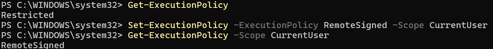
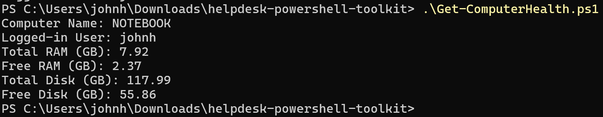
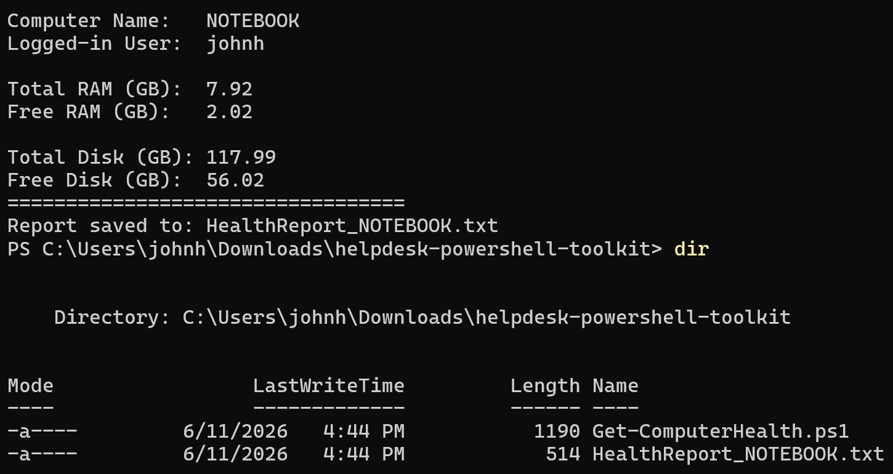
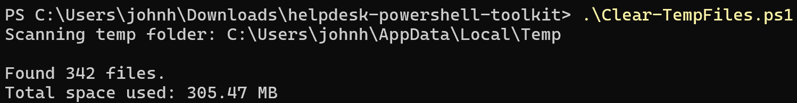
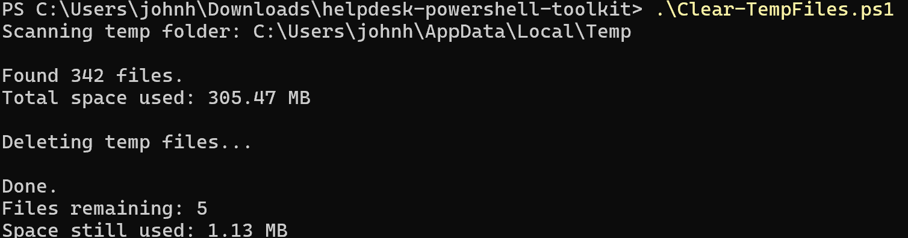

# Helpdesk PowerShell Toolkit

A small collection of PowerShell scripts for common IT support and helpdesk tasks. Built to automate the kind of routine checks and cleanup a technician handles daily, and to practice safe, well-documented scripting.

## Why this exists

Helpdesk work is full of repetitive tasks: checking a machine's specs when someone reports it is slow, clearing junk files when a disk fills up, and keeping records for tickets. These scripts automate those tasks and produce clean, shareable output.

All scripts are written in PowerShell, which is built into Windows and requires no extra software to run.

## Setup

PowerShell blocks scripts by default as a security measure. To allow locally written scripts to run while still blocking unsigned scripts from the internet, the execution policy is set to `RemoteSigned` for the current user only (no administrator rights required):

```powershell
Set-ExecutionPolicy -ExecutionPolicy RemoteSigned -Scope CurrentUser
```



## Scripts

### 1. Get-ComputerHealth.ps1

Gathers a machine's basic vitals into a quick report: computer name, logged-in user, total and free RAM, and total and free disk space. This is the first thing a technician checks when a user reports performance problems.

The script displays the report on screen and also saves a timestamped copy to a text file, so it can be attached to a support ticket or kept as a record.

Running the script:



The report is saved to a text file in the same folder, confirmed with a directory listing:



Example usage:

```powershell
.\Get-ComputerHealth.ps1
```

### 2. Clear-TempFiles.ps1

Scans the user's TEMP folder, reports how many temporary files exist and how much space they use, then safely deletes them.

This script was built with safety in mind, since it deletes files:

- It only targets the user TEMP folder (`$env:TEMP`), which is designed to hold disposable files. Nothing else is touched.
- Files that are currently in use by running programs are skipped automatically rather than forced, so the script cannot interfere with active processes.
- It reports totals before and after, so the result is always visible.

Scan before cleanup:



After cleanup, with locked files correctly skipped:



Example usage:

```powershell
.\Clear-TempFiles.ps1
```

## Skills demonstrated

- Writing and running PowerShell scripts
- Querying system information with `Get-CimInstance`
- Working with variables, environment variables, and formatted output
- Exporting reports to files
- Safe handling of destructive operations (scan first, target a known-safe location, skip locked files)
- Following PowerShell naming conventions (Verb-Noun)

## Notes

These scripts were tested on Windows. They are intended as learning and portfolio pieces demonstrating practical helpdesk automation.
